# 1장 AWS (Amazon Web Service) 기초지식

## 1-1 AWS가 뭐에요?
### 🍀 아마존 사에서 제공하는 클라우드 서비스  
Cloud 라는 단어가 말해주듯, 인터넷 통신망 어딘가에서 구름에 싸여 보이지 않는 컴퓨팅 자원(CPU, 메모리, 디스크 등)을 원하는 대로 가져다 쓸 수 있다.  

- **2002년** 인터넷 쇼핑몰인 Amazon.com에서 2002년 웹 사이트 도구 제공 

- **2006년** 스토리지인 S3 와 서버 EC2를 제공하면서 클라우드 컴퓨팅 서비스를 시작 (Simple Storage Service, Elastic Compute Cloud)
- **2008년** 클라우드 시장이 핫해지기 시작함, 구글 GCP 와 MS의 애저가 베타 테스트를 시작, AWS 발전 가속화
- **2009년** 가상 사설망 (VPC, Virtual Private Cloud) 출시, 지역별로 데이터센터를 선택할 수 있게 제공 
- **2012년** 데이터 관련 여러서비스 출시 (DynamoDB, Kinesis 등)
- **2013년** 미국 CIA의 네트워크 망을 AWS가 계약을 맡게됨. 엄청난 투자와 발전 가속화

 

### 🍀 클라우드 서비스 별 점유율

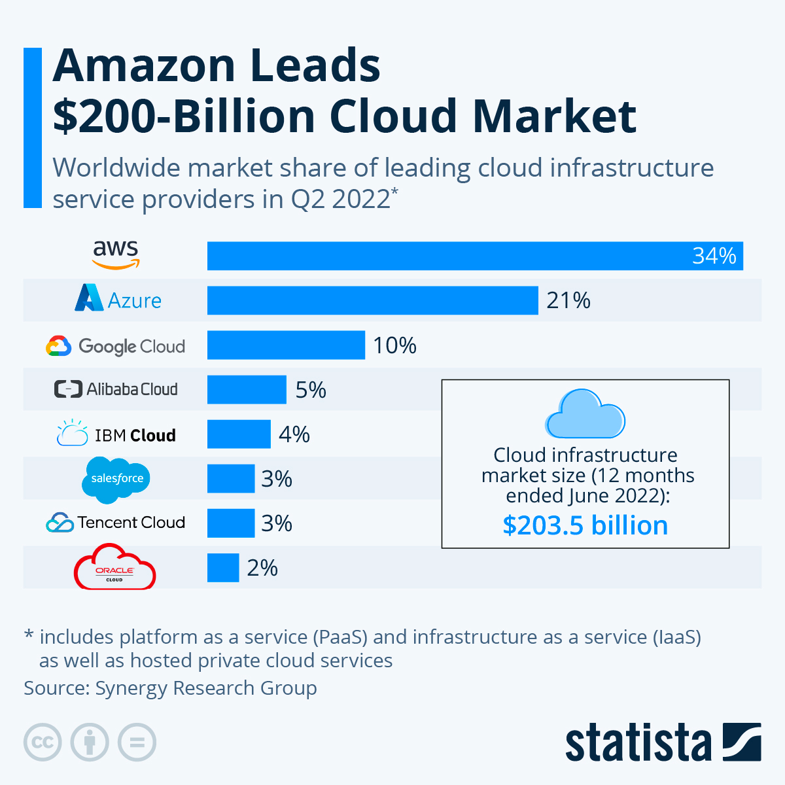

 

### 🍀 헷갈리는 Cloud 용어정리

[클라우드 설명하는 사물궁이 영상](https://www.youtube.com/watch?v=CpPEJyWwIgY) 

- **On-premise** 전통적인 서버방식. 내가 컴퓨터 사서 직접 서버실을 관리하는 것이다.
- **Private cloud** 특정 개인 또는 회사를 위한 전용 클라우드 서버. 사실상 거대한 On-premise 라고 보면 된다.
- **Public Cloud** 컴퓨터 리소스를 제공해주는 업체가 따로 있으며 사용한 만큼만 지불하는 클라우드, `AWS, Azure, GCP 전부 여기에 해당된다`

 

클라우드 서비스는 `서비스 운영에 필요한 모든 것을 All-in-one` 제공하는 곳도 있고, 딱 내가 원하는 인프라만 제공해줄 수도 있다.

- 개발자를 위한 서버 자원, 즉 인프라만 서비스로 제공 ( IaaS, Infra as a Service)
- 개발자를 위한 서버 인프라, OS, 미들웨어등 플랫폼 제공 ( Paas, Platform as a Service)
- 아예 어플리케이션 서비스로 말아서 제공, 바로 사용가능 ( SaaS Software as a Service)

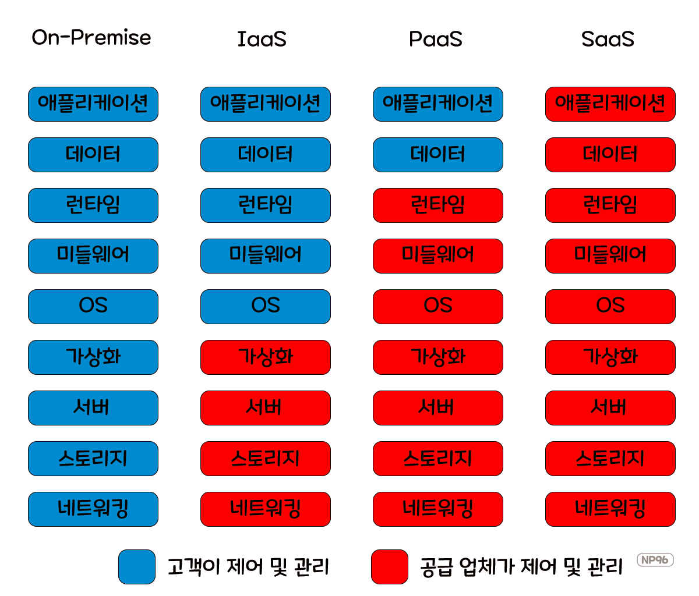

 

## 1-3 클라우드, 꼭 사용해야하나요?

### 👏🏻 우리집에서 서버를 구성한다면 어떨까요?
- **데이터는 어떻게 관리해야 할까요?** `정전이 나거나 도둑이 든다면 어쩌죠, 보안적인 이슈나 백업은 어떻게 구성하죠?`
- **서버는 어떻게 관리해야 할까요?** `서버 컴퓨터에 여러 프로그램을 함께 설치해도 괜찮을까요, 장비가 망가지면 서비스도 중단해야할까요?`
- **네트워크는 어떻게 관리해야 할까요?** `우리집 인터넷으로 한번에 몇명이나 접속가능할까요, 문제가 생겼을 때 외부에서는 어떻게 접근할까요? `

 

### 👏🏻 사무실에 직접 서버실을 운영한다면 어떨까요?
서버가 간단한 경우 사무실에 두고 운영하는 방법도 있겠죠. 하지만 여전히 모든 문제가 해결되지는 않습니다. 참고로 전기세, 물리적인 장비 구매 및 관리, 네트워크 및 서버 관리 비용을 생각해보면 보통 Public Cloud가 훨씬 저렴한 경우도 많습니다.

- **데이터는 어떻게 관리해야 할까요?** `다른 팀과 데이터, 코드, 파일은 어떻게 공유해야 할까요? 백업 구성은 어떻게 하죠?`
- **서버는 어떻게 관리해야 할까요?** `서버 장비관리, OS 설치는 누가하죠, 서버가 부족할지, 넘칠지 어떻게 알고 준비하죠?`
- **네트워크는 어떻게 관리해야 할까요?** `인프라 장애가 발생하면 어떻게 하죠? 보안이나 네트워크 장비는 누가 유지보수해야 할까요?`

 

### 👏🏻 거래처를 만들어서 우리 회사 전용 데이터센터를 사용하면 되지 않을까요?
그렇다면 업체가 제공해주는 데이터센터를 클라우드로 사용한다면 위의 문제들이 전부 해결되는걸까요? 당연히 아닐겁니다.

기술적인건 물론이고 보안이나 서버구성에 법적으로도 문제가 됩니다. 관리적/물리적인 안전조치를 따로 해야합니다.
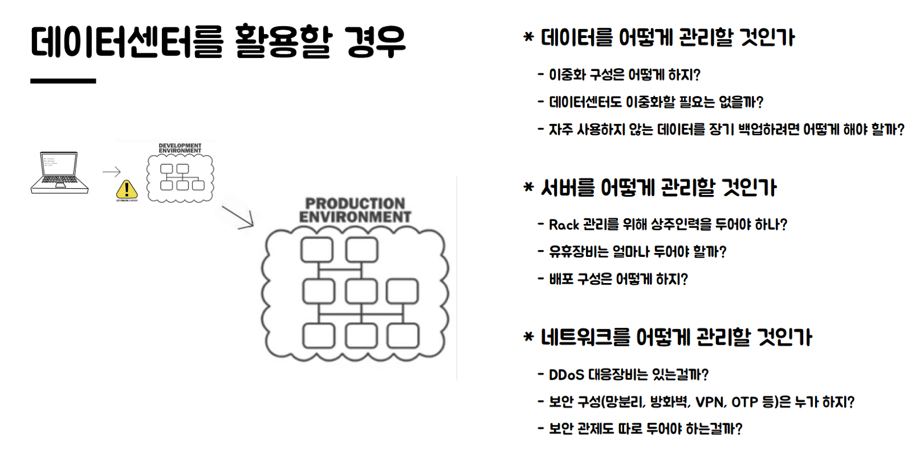

 

### 아니 서비스 만들기도 바쁜데, 서버 하나 띄우기 더럽게 힘드네;;

어떤 서비스를 만들지도 정하지 않았는데, 고려해야할 대상이 너무 많습니다. 저 수많은 요소들을 누가 구축하고 관리해야할까요?

Public Cloud를 사용하는 이유는 바로 여기에 있습니다. **관심사의 분리**요.  

클라우드를 사용한다는건 단순히 서버를 원격으로 관리한다는걸 의미하는게 아닙니다. 위의 문제들에 대한 관심사를 클라우드 업체에게 맡기고, 우리가 가진 리소스를 더 중요한 대상 `우리 서비스`에 집중하는 것에 의의가 있습니다.

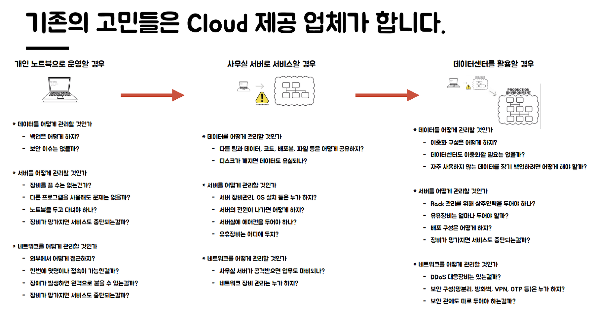

 

### 참고로 Public Cloud도 만능은 아닙니다.
필요에 따라 인프라를 유연하게 대처할 수 있어야해요.
- 가용성의 함정: 99.9% 서비스를 제공한다는 말은 1년에 8시간은 장애가 난다는 이야기에요. `물론 AWS 자체에서 바로 복구를 해주지만, 그 시간동안 할 수 있는게 없어요`
- 비용: 초기 비용은 저렴하지만 점점 AWS에 묶일 수록 억단위로 비용이 나올 수 있어요
- 지역적 제한: AWS가 제공하는 데이터센터만으론 원하는 응답 속도가 나오지 않을 수 있어요. `특정 지역 전용이거나 실시간 게임서버등 레이턴시가 중요하다면 별도 구축하는게 더 나을 수 있습니다.`

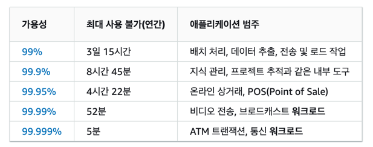

 

## 1-2 통신망 (Network)에 대한 이해
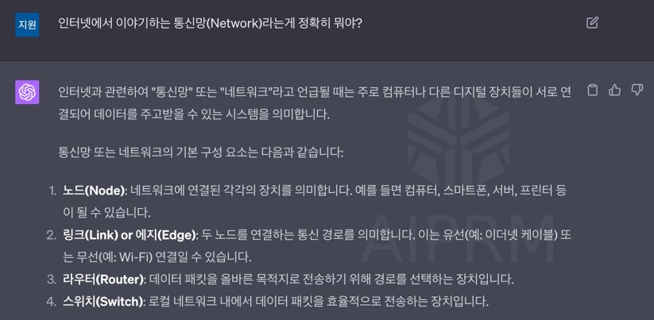
AWS에서 사용하는 인프라 이름들은 실제 네트워크 용어들에서 나온 단어들이에요.
여러 산업에서 사용하는 단어지만 보통 아래와 같은 의미를 가집니다.
- 통신망(Network)란 여러 노드들이 링크로 통신하는 시스템을 이야기해요.
- 노드(Node)란, 고유한 주소 즉 IP로 식별할 수 있는 대상을 의미해요
- 링크(Link)란, 통신이 가능한 물리적인 회선을 이야기해요.

 

### AWS에서의 망
가장 기본적으로는 Subnet 이 하나의 망이라고 생각하면 편해요.
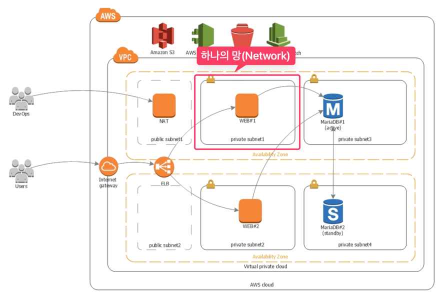

 

AWS에서는 Region `국가(지역)` - Availabilty Zone `해당 지역의 데이터센터` - VPC `가상 사설망 구분`으로 망을 관리하고 있어요.
- VPC는 AWS에만 존재하는 가상의 망이에요. VPC 고유의 IP대역을 가지게 됩니다.
- VPC는 하나의 Region에 종속되지만 아래 그림처럼 여러 AZ에 걸쳐있을 수 있어요.
`다른 Region간의 VPC 통신이 필요하다면, Peer to Peer 등으로 별도 연결해야합니다.`
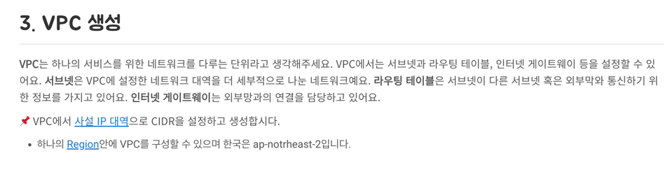

참고로 대한민국용 Seoul Region (ap-southeast-2) 에는 4개의 AZ가 있습니다.
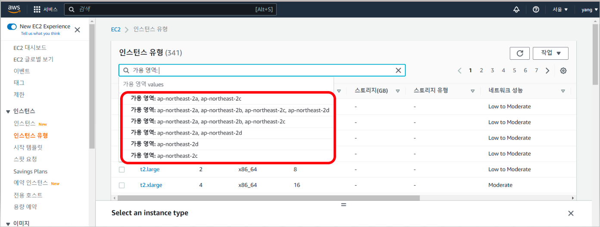

 

### 네트워크 L2 스위치에 대한 이해
여기서 말하는 스위치는 OSI 7 Layer에서 L2 스위치를 의미해요.
- 기본적으로 스위치는 다중연결(Multiple Access)를 위한 장비입니다.
- 서버에는 랜카드 (Network Interface Card)가 있고 랜카드마다 고유한 mac 주소가 존재합니다.
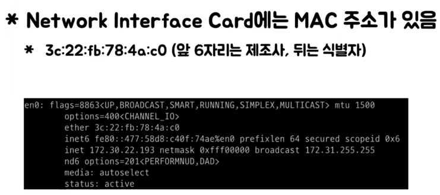
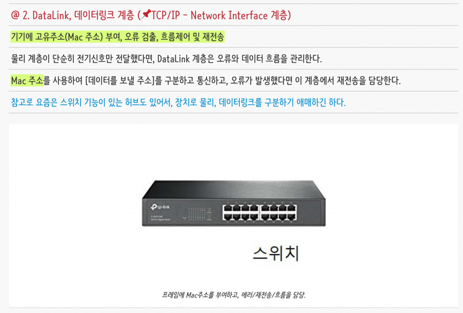

L2 스위치를 이용하면 **🛜 하나의 네트워크** 에 여러 대의 서버를 연결할 수 있어요.
- 스위치에 있는 mac 테이블에 이미 있다면 바로 전달(Forward)하고
없다면 전체에게 기기에게 물어봐서(Flooding)목적지를 찾습니다. `이를 이용한 해킹인 Mac Flooding 공격도 있죠.`
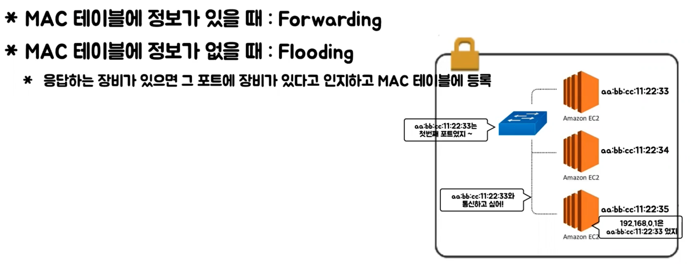

 

### 여러 네트워크를 연결하는 Router에 대한 이해
Router란 드넓은 인터넷에서 서로 다른 네트워크들을 연결해주는 장비에요.
- Router는 L3 장비로 IP주소를 기반으로 패킷을 전달합니다.
- 라우터도 스위치와 동일하게 라우팅 테이블을 가지고있으며, 정보가 없으면 요청을 삭제(Drop) 해버려요.
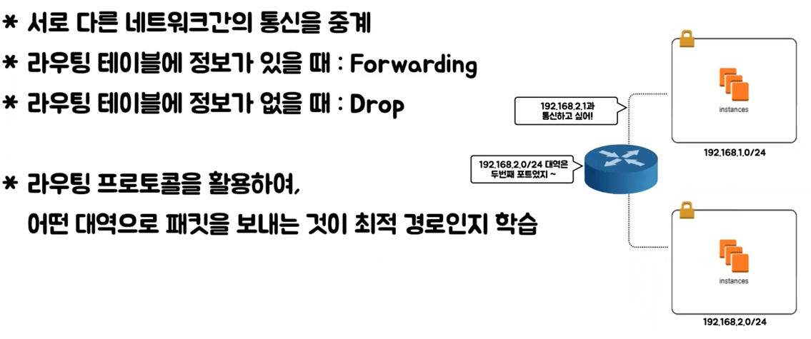
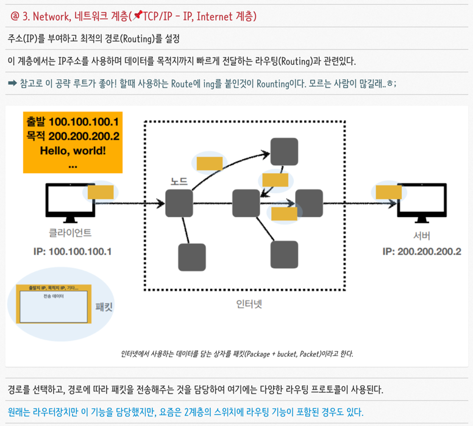

 

### 서브네팅에 대한 이해
서브네팅은 한 네트워크 내에서 네트워크 영역을 분리하는걸 의미해요. 이 과정은 L3 스위치나 라우터에서 처리되요.
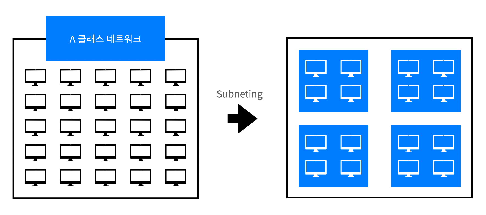

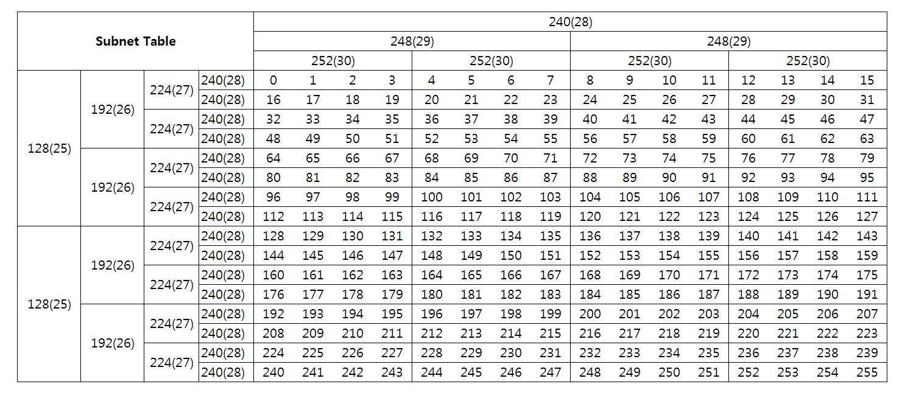
VPC는 n개의 Subnet을 가질 수 있으며, Subnet은 VPC의 CIDR 내에서 구성할 수 있어요.

AWS의 AZ(Availablity Zone)란, 물리적으로 나뉜 IDC입니다.
- Subnet 구성시, AZ를 함께 설정하는데요. 재해 및 재난 대비 개인정보처리시스템의 물리적 안전조치를 고려해 Subnet의 AZ를 다르게 구성합니다
- 하나의 VPC 내에 구성된 Subnet들은 물리적으로 다른 IDC에 구성되더라도 사설망을 통해 통신이 가능합니다. 다른 AZ간의 통신시 비용이 발생하기는 하나, 무시할만한 수준이에요.
- 
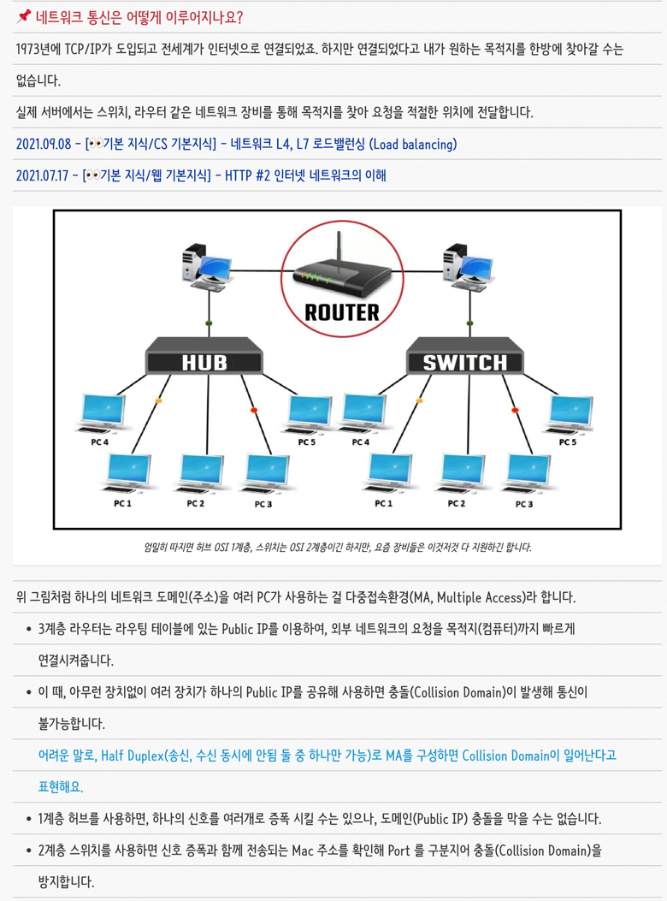
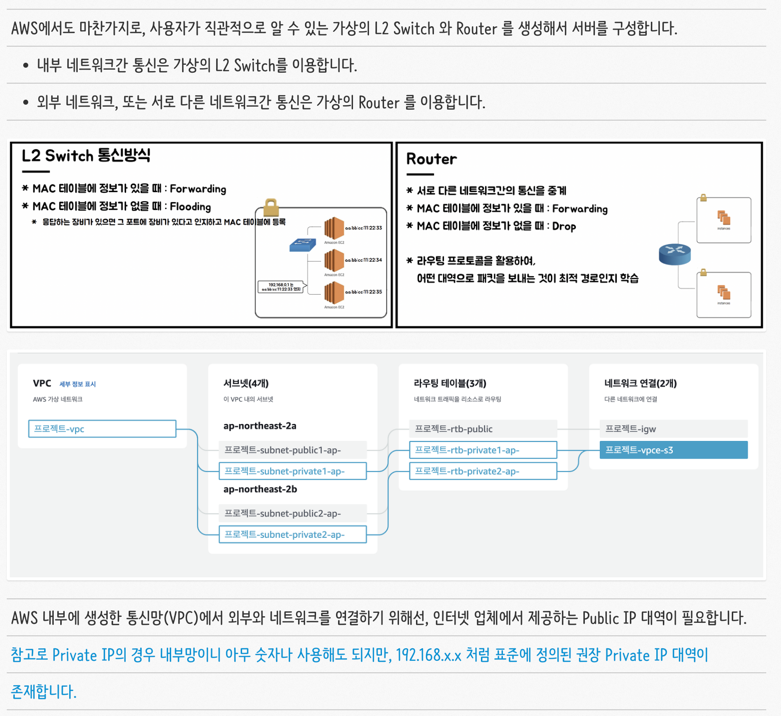
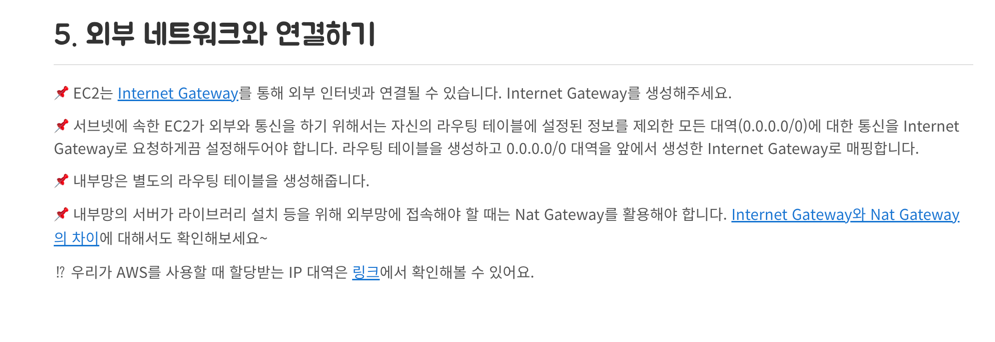
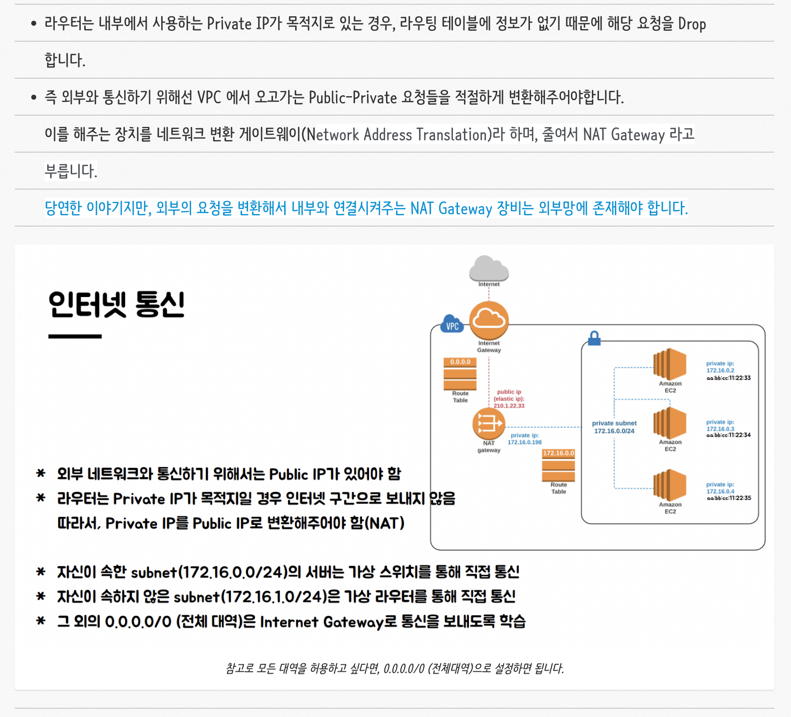
 

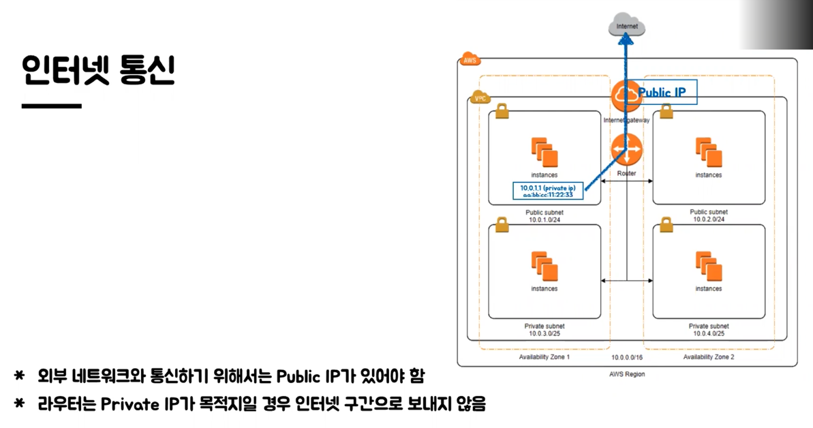
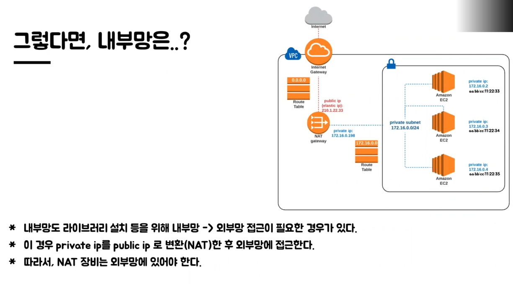

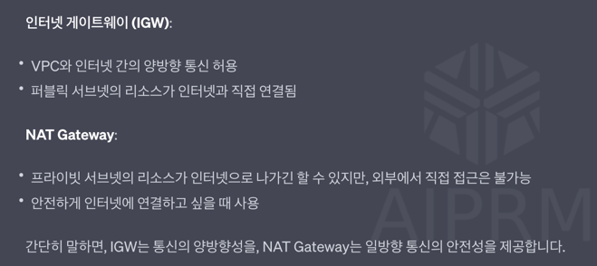